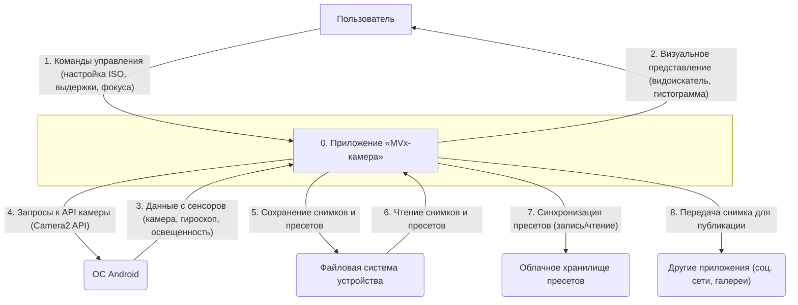
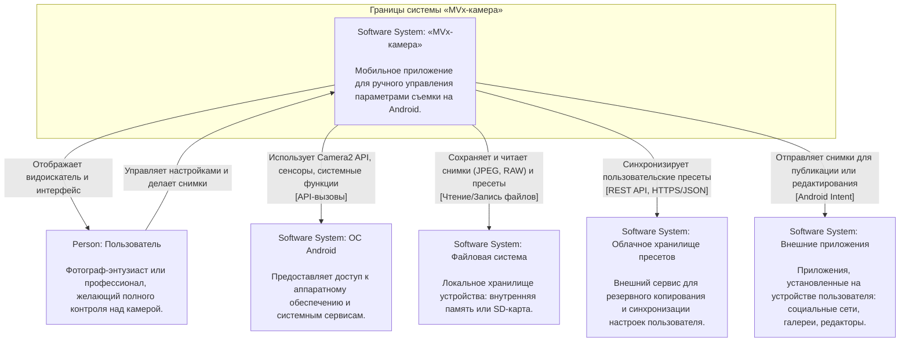

Конечно. Основываясь на всей предоставленной ранее информации, я подготовил описание границ системы «МVx-камера» в запрошенных форматах.

### 1. Графическое представление границ системы

Поскольку я не могу генерировать изображения напрямую, я представлю диаграммы в текстово-графическом формате, который легко визуализировать. Обе диаграммы описывают один и тот же уровень абстракции (контекст системы), но используют разную нотацию.

---

#### 1.1 Контекстная диаграмма (нотация Yourdon/DeMarco)

Эта диаграмма представляет систему как единый процесс ("черный ящик") и показывает ее взаимодействие с внешними сущностями.

#### 1.2 Диаграмма контекста системы C4 (уровень C1)

Эта диаграмма фокусируется на взаимодействии пользователей (Actors) и других программных систем (Software Systems) с нашей системой.

---

### 2. Подробное текстовое описание диаграмм

Обе диаграммы иллюстрируют границы мобильного приложения **«МVx-камера»** и его взаимодействие с внешним миром. Система взаимодействует со следующими внешними акторами и системами:

**1. Пользователь (Person/Внешняя сущность)**
*   **Описание:** Основной актор системы. Это фотограф-энтузиаст или профессионал, который непосредственно взаимодействует с интерфейсом приложения.
*   **Данные и способы интеграции:**
    *   **От пользователя к системе:** Пользователь передает команды управления через сенсорный интерфейс. Это дискретные события: касания кнопок, движения ползунков для настройки ISO, выдержки, фокуса, баланса белого, а также команды на спуск затвора, сохранение пресета и т.д.
    *   **От системы к пользователю:** Система предоставляет визуальную обратную связь в реальном времени. Это непрерывный поток видеоданных в видоискателе, а также графические оверлеи: гистограмма, сетка, "зебра", значения текущих параметров, меню.

**2. ОС Android (Software System/Внешняя сущность)**
*   **Описание:** Операционная система, в среде которой функционирует приложение. Она выступает посредником для доступа к аппаратному обеспечению.
*   **Данные и способы интеграции:**
    *   **От системы к ОС:** Приложение отправляет низкоуровневые запросы на управление оборудованием. Интеграция происходит через вызовы системного **Camera2 API** для управления параметрами камеры. Также используются API для доступа к данным с других сенсоров (гироскоп, акселерометр, датчик освещенности).
    *   **От ОС к системе:** ОС поставляет приложению поток данных с камеры (для видоискателя и съемки), а также данные с сенсоров.

**3. Файловая система устройства (Software System/Внешняя сущность)**
*   **Описание:** Локальное хранилище на смартфоне пользователя (внутренняя память или SD-карта).
*   **Данные и способы интеграции:**
    *   **От системы к ФС:** Приложение выполняет операции **записи файлов**. Сохраняются сделанные снимки в форматах JPEG, RAW, HEIF и файлы конфигурации пользовательских пресетов (например, в формате JSON или XML).
    *   **От ФС к системе:** Приложение выполняет операции **чтения файлов** для загрузки ранее сохраненных пресетов в интерфейс или для отображения сделанных снимков во внутренней галерее (если таковая будет реализована).

**4. Облачное хранилище пресетов (Software System)**
*   **Описание:** Внешний серверный компонент (backend), отвечающий за хранение, резервное копирование и синхронизацию пользовательских пресетов между разными устройствами.
*   **Данные и способы интеграции:**
    *   **Двусторонняя интеграция:** Обмен данными происходит по сети. Приложение отправляет и запрашивает файлы или фрагменты данных (например, пресеты в формате **JSON**) на сервер через защищенный протокол **HTTPS**, используя **REST API**. Для доступа к данным требуется авторизация пользователя (например, по токену).

**5. Внешние приложения (Software System/Внешняя сущность)**
*   **Описание:** Другие приложения, установленные на смартфоне пользователя, такие как социальные сети, мессенджеры, галереи, облачные хранилища (Google Photos, Dropbox) или фоторедакторы.
*   **Данные и способы интеграции:**
    *   **От системы к внешним приложениям:** Интеграция осуществляется через стандартный механизм операционной системы — **Android Intent**. Когда пользователь нажимает "Поделиться", «МVx-камера» создает Intent, содержащий URI сделанного снимка, и передает его ОС. ОС, в свою очередь, предлагает пользователю список приложений, способных обработать этот Intent (например, Instagram, Telegram). Прямой интеграции "приложение-приложение" здесь нет, все взаимодействие происходит через ОС.
